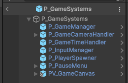

# Gameplay System

Gameplay code for Unity Games.

## Features

### Using GameplayManager

The global manager for Gameplay. Put [GameplayManager](/Runtime/GameplayManager.cs) component inside a GameObject into your Game Scene and set its `CurrentState` for all Gameplay states in your game.

You can listen for those state changes by subscribing to the static event `GameplayManager.OnStateChanged`.

### Using PrefabLoader

Use this component to loads (and unloads) a Prefab using Addressables.

### Using GameLoader

After the Game Scene is load (in the first frame), use the component [GameLoader](/Runtime/Loaders/GameLoader.cs) to load a series of [ILoadable](/Runtime/Loaders/ILoadable.cs) implementations as Game Objects children, one at a time, in the order they are in the hierarchy as children.

Use it to load code asynchronously in order, as soon as the Game Scene is ready. It works both from the Main Menu or just in the Play mode.

## Installation

### Using the Git URL

You will need a **Git client** installed on your computer with the Path variable already set and the correct git credentials to 1M Bits Horde.

- In this repo, go to Code button, select SSH and copy the URL.
- In Unity, use the **Package Manager** "Add package from git URL..." feature and paste the URL.
- Set the version adding the suffix `#[x.y.z]` at URL

---

**1 Million Bits Horde**

[Website](https://www.1mbitshorde.com) -
[GitHub](https://github.com/1mbitshorde) -
[LinkedIn](https://www.linkedin.com/company/1m-bits-horde)